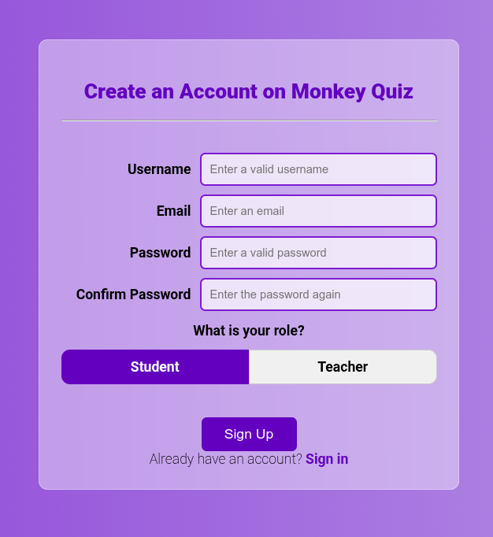
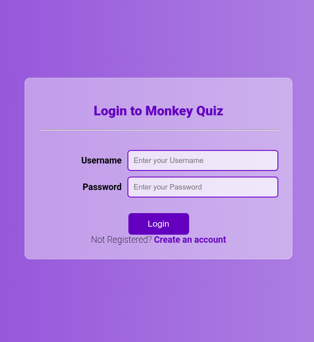
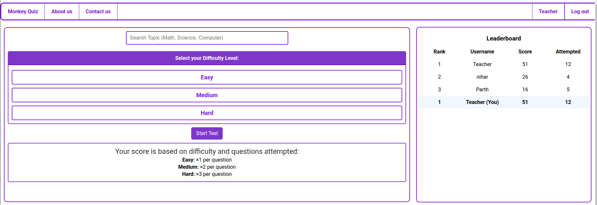
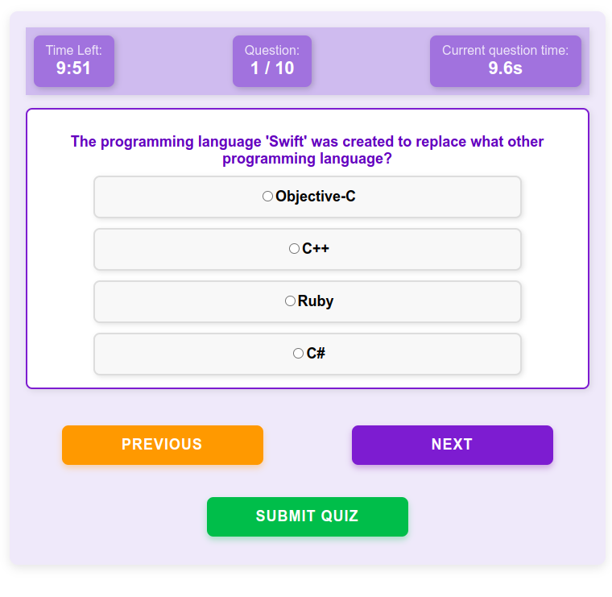
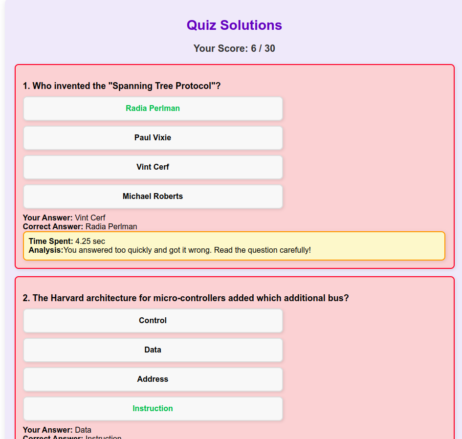
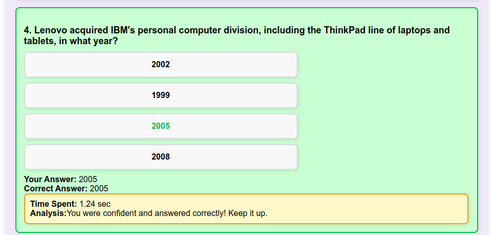
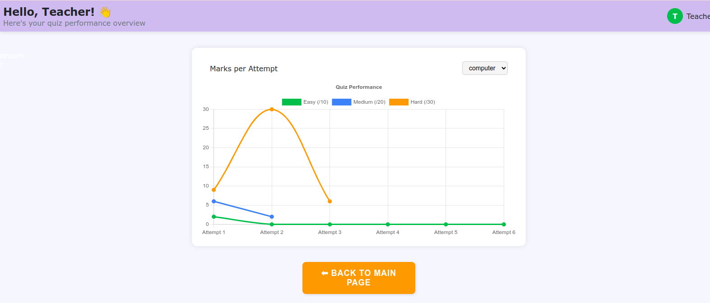
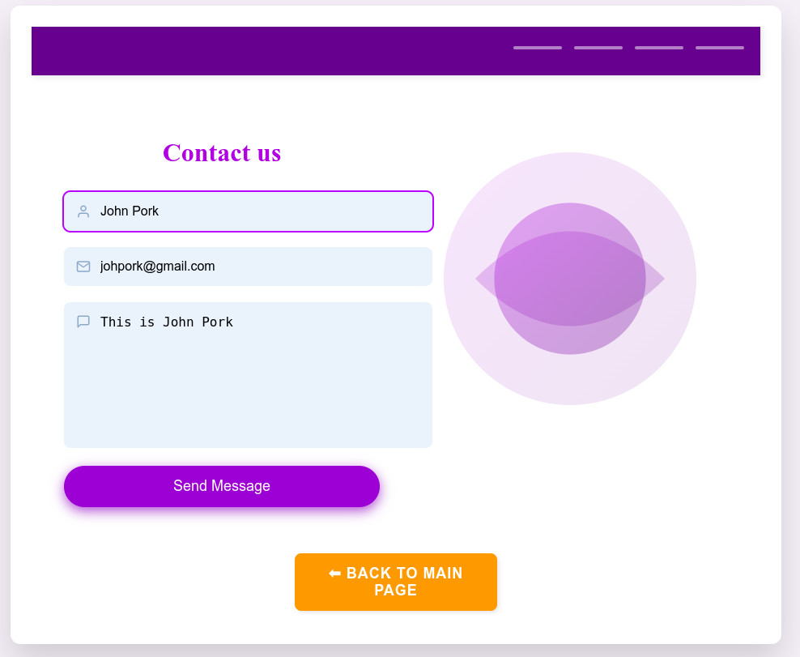

# Monkeyquiz
Web programming mini-project
A full-stack quiz platform project made for college submission.
Built with React (Vite) on the frontend and Node.js + Express on the backend and MongoDB for database (MERN).

## Developed by:
- Nihar Sudheer
- Parth Nilesh Patil
- Parth Sanjay Mhatre
## Features
- User Authentication (Login / Signup)
- Create Quizzes
- Upload and Solve Quizzes
- Classroom Management
- Leaderboard
- Student Dashboard
- Profile Management
- Contact Us and About Us pages
  
## ScreenShots of the Project
This is the **Home Page**<br><br>
<br><br>
<table border="0" >
  <tr>
    <td width="450px">The <b>Sign up</b> page has a role based sign up so if user selects the Student role user can join a classroom and if Teacher role user can create classrooms & quizzes</td>
    <td width="450px">In the <b>Login Page</b> the login is properly done with Hashing of password and with proper Client side Validation</td>
  </tr>
  <tr>
    <td></td>
    <td></td>
  </tr>
</table>
The bellow is the <b>Quiz test section</b> and <b>leaderboard</b> the user can select any quiz and difficulty and give test the marks will be stored and leaderboard is prepared accordingly<br><br>

Now as we start test we go into Fullcreen mode if fullscreen mode exitted than quiz will be automatically submitted the quiz calculates the time spent on each question to give a proper analysis in the solution of the quiz<br><br>

Now the <b>Solution Page</b><br><br>


Now as users gave the quiz their marks got stored as per the type of difficulty and subject they selected and the graph is made accordingly<br><br>

The <b>Contact us</b> page is a working Page with mails beign sent and received<br><br>



## Installation
### 1. Clone the Repository
```bash
git clone https://github.com/aircokezero/Monkeyquiz.git
cd Monkeyquiz
```

### 2. Install Dependencies
#### Frontend (Monkey)
```bash
cd monkey
npm install
```

#### Backend
```bash
cd backend
npm install
```

## Configuration
### Frontend
Frontend is built using React with Vite.
No special configuration required.

### Backend
Backend uses Node.js, Express.js, and MongoDB.
Update any DB connection strings inside backend/models/db.js.

## Running the Application
### Start the Backend Server
```bash
cd backend
node server.js
```
The backend server should now be running at http://localhost:5000.

### Start the Frontend App
```bash
cd monkey
npm run dev
```
The frontend should now be live at http://localhost:5173 as per Vite.

## File structure
```bash
.
├── backend
│   ├── controllers
│   │   └── authc.js
│   ├── models
│   │   ├── ApiQuiz.js
│   │   ├── ClassQuiz.js
│   │   ├── Classroom.js
│   │   ├── db.js
│   │   ├── Profiles.js
│   │   ├── Quiz.js
│   │   ├── StudentClass.js
│   │   └── StudSol.js
│   ├── package.json
│   ├── package-lock.json
│   ├── routes
│   │   ├── authRoutes.js
│   │   ├── class.js
│   │   ├── classroom.js
│   │   └── quizRoutes.js
│   └── server.js
└── monkey
    ├── eslint.config.js
    ├── index.html
    ├── package.json
    ├── package-lock.json
    ├── public
    │   └── vite.svg
    ├── README.md
    ├── src
    │   ├── App.css
    │   ├── App.jsx
    │   ├── assets
    │   │   └── react.svg
    │   ├── component
    │   │   ├── Classroom.css
    │   │   ├── Classroom.jsx
    │   │   ├── ClassroomQuizzes.css
    │   │   ├── ClassroomQuizzes.jsx
    │   │   ├── CreateQuiz.css
    │   │   ├── CreateQuiz.jsx
    │   │   ├── leaderboard.css
    │   │   ├── Leaderboard.jsx
    │   │   ├── Navbar.css
    │   │   ├── Navbar.jsx
    │   │   ├── QuizContext.jsx
    │   │   ├── QuizM.css
    │   │   ├── QuizM.jsx
    │   │   ├── StudentList.css
    │   │   ├── StudentList.jsx
    │   │   ├── UploadQuiz.css
    │   │   └── UploadQuiz.jsx
    │   ├── index.css
    │   ├── main.jsx
    │   └── pages
    │       ├── AboutUs.jsx
    │       ├── about_us_style.css
    │       ├── ClassroomPage.css
    │       ├── ClassroomPage.jsx
    │       ├── ContactForm.css
    │       ├── ContactForm.jsx
    │       ├── default.jpg
    │       ├── EditQuiz.css
    │       ├── EditQuiz.jsx
    │       ├── Home.jsx
    │       ├── JoinedClass.jsx
    │       ├── Login.css
    │       ├── Login.jsx
    │       ├── monkeyquiz-css.css
    │       ├── monkeyquiz.jpg
    │       ├── quiz_hero.avif
    │       ├── QuizSol2.jsx
    │       ├── QuizSol.css
    │       ├── QuizSol.jsx
    │       ├── QuizTest2.css
    │       ├── QuizTest2.jsx
    │       ├── QuizTest.css
    │       ├── QuizTest.jsx
    │       ├── Signup.css
    │       ├── Signup.jsx
    │       ├── studentdashboard.css
    │       ├── StudentDashboard.jsx
    │       ├── TestPage.css
    │       └── TestPage.jsx
    └── vite.config.js

11 directories, 74 files
```

## Credits
Developed with ❤️ by <br>
<b>Nihar Sudheer</b>, <b>Parth Nilesh Patil</b>, and <b>Parth Sanjay Mhatre</b>.
